# 🏗️ Arquitectura Completa - Infrastructure AI Platform

## Diagrama Principal del Sistema Completo

```mermaid
graph TB
    subgraph "Usuario/Cliente"
        USER[👤 Usuario]
        DEV[👨‍💻 Developer]
        ARCH[🏗️ Architect]
    end
    
    subgraph "Backstage IDP Platform"
        subgraph "Frontend - React App"
            UI[🖥️ Backstage UI<br/>Port: 3000]
            CAT[📋 Service Catalog]
            TEMP[📝 Templates]
            DOCS[📚 TechDocs]
        end
        
        subgraph "Backend - Node.js"
            API_BS[🔌 Backstage API<br/>Port: 7007]
            PROC_BS[⚙️ Catalog Processor]
            AUTH[🔐 Authentication]
        end
    end
    
    subgraph "Infra AI Agent - Core System"
        subgraph "API Layer"
            FASTAPI[🚀 FastAPI Server<br/>Port: 8000]
            ENDPOINTS[📍 Endpoints<br/>/process-diagram<br/>/process-text<br/>/analyze-architecture]
        end
        
        subgraph "Processing Layer"
            VISION[👁️ Vision Processor<br/>Gemini Vision API]
            TEXT[📝 Text Processor<br/>Gemini Text API]
            ROUTER[🔀 Request Router]
        end
        
        subgraph "AI Integration"
            GEMINI_V[🤖 Gemini Vision<br/>gemini-1.5-pro]
            GEMINI_T[🤖 Gemini Text<br/>gemini-1.5-pro]
            PROMPT_ENG[⚙️ Prompt Engineering]
        end
        
        subgraph "Generation & Validation"
            YAML_GEN[📄 YAML Generator]
            VALIDATOR[✅ Backstage Validator]
            MAPPER[🗺️ Service Mapper<br/>AWS → Backstage]
        end
        
        subgraph "Integration Layer"
            GIT_CLIENT[📦 Git Client]
            WEBHOOK[🔗 Webhook Handler]
            METRICS[📊 Metrics Collector]
        end
    end
    
    subgraph "External Services"
        GOOGLE_AI[🌐 Google AI Platform<br/>Gemini APIs]
        GITHUB[🐙 GitHub<br/>Repositories]
    end
    
    subgraph "Storage & Repositories"
        subgraph "Agent Repository"
            AGENT_REPO[📁 infra-ai-agent<br/>Python Code]
        end
        
        subgraph "Templates Repository"
            TEMPLATES_REPO[📁 catalog-repo<br/>YAML Files]
            COMPONENTS[🧩 Components]
            RESOURCES[🗃️ Resources]
            SYSTEMS[🏗️ Systems]
        end
        
        subgraph "Backstage Repository"
            BS_REPO[📁 backstage-idp<br/>Node.js App]
            BS_CONFIG[⚙️ app-config.yaml]
            BS_PLUGINS[🔌 Plugins]
        end
    end
    
    %% User Interactions
    USER --> UI
    DEV --> UI
    ARCH --> UI
    USER --> FASTAPI
    
    %% Backstage Internal Flow
    UI --> API_BS
    API_BS --> PROC_BS
    PROC_BS --> CAT
    CAT --> TEMP
    CAT --> DOCS
    
    %% AI Agent Processing Flow
    FASTAPI --> ENDPOINTS
    ENDPOINTS --> ROUTER
    ROUTER -->|PNG Image| VISION
    ROUTER -->|Text Description| TEXT
    ROUTER -->|Hybrid Request| VISION
    ROUTER -->|Hybrid Request| TEXT
    
    %% AI Processing
    VISION --> GEMINI_V
    TEXT --> GEMINI_T
    GEMINI_V --> GOOGLE_AI
    GEMINI_T --> GOOGLE_AI
    GOOGLE_AI --> PROMPT_ENG
    PROMPT_ENG --> YAML_GEN
    
    %% Validation & Generation
    YAML_GEN --> MAPPER
    MAPPER --> VALIDATOR
    VALIDATOR --> GIT_CLIENT
    
    %% External Integrations
    GIT_CLIENT --> GITHUB
    GITHUB --> TEMPLATES_REPO
    TEMPLATES_REPO --> COMPONENTS
    TEMPLATES_REPO --> RESOURCES
    TEMPLATES_REPO --> SYSTEMS
    
    %% Backstage Integration
    TEMPLATES_REPO --> PROC_BS
    PROC_BS --> CAT
    WEBHOOK --> METRICS
    
    %% Repository Management
    AGENT_REPO --> FASTAPI
    BS_REPO --> UI
    BS_CONFIG --> API_BS
    
    %% Styling
    classDef userClass fill:#e1f5fe,stroke:#01579b,stroke-width:2px
    classDef backstageClass fill:#f3e5f5,stroke:#4a148c,stroke-width:2px
    classDef aiClass fill:#e8f5e8,stroke:#1b5e20,stroke-width:2px
    classDef storageClass fill:#fff3e0,stroke:#e65100,stroke-width:2px
    classDef externalClass fill:#fce4ec,stroke:#880e4f,stroke-width:2px
    
    class USER,DEV,ARCH userClass
    class UI,CAT,TEMP,DOCS,API_BS,PROC_BS,AUTH backstageClass
    class FASTAPI,ENDPOINTS,ROUTER,VISION,TEXT,YAML_GEN,VALIDATOR,MAPPER,GIT_CLIENT,WEBHOOK,METRICS,GEMINI_V,GEMINI_T,PROMPT_ENG aiClass
    class AGENT_REPO,TEMPLATES_REPO,BS_REPO,COMPONENTS,RESOURCES,SYSTEMS,BS_CONFIG,BS_PLUGINS storageClass
    class GOOGLE_AI,GITHUB externalClass
```

## Estructura Completa del Proyecto

```mermaid
graph TD
    subgraph "📁 /home/giovanemere/demos/"
        subgraph "🤖 infra-ai-agent/"
            AGENT_CODE[📄 Python Code<br/>FastAPI + Gemini]
            AGENT_DOCS[📚 Documentation]
            AGENT_CONFIG[⚙️ Configuration]
        end
        
        subgraph "📁 catalog-repo/"
            CATALOG_YAML[📄 YAML Files<br/>Generated by AI]
            CATALOG_COMP[🧩 Components]
            CATALOG_RES[🗃️ Resources]
        end
        
        subgraph "🎭 backstage-idp/"
            BS_APP[📱 Backstage App<br/>Node.js + React]
            BS_CONFIG_FILE[⚙️ app-config.yaml]
            BS_SCRIPTS[🔧 Setup Scripts]
        end
        
        PROJECT_DOCS[📋 REPOSITORY_STRUCTURE.md]
    end
    
    subgraph "🌐 GitHub Repositories"
        REPO1[📦 demo-infra-ai-agent]
        REPO2[📦 demo-infra-ai-agent-template-idp]
        REPO3[📦 backstage-idp<br/>🆕 Nuevo]
    end
    
    subgraph "🚀 Running Services"
        SERVICE1[🤖 AI Agent<br/>:8000]
        SERVICE2[🎭 Backstage<br/>:3000/:7007]
    end
    
    AGENT_CODE --> REPO1
    CATALOG_YAML --> REPO2
    BS_APP --> REPO3
    
    REPO1 --> SERVICE1
    REPO3 --> SERVICE2
    
    SERVICE1 --> CATALOG_YAML
    CATALOG_YAML --> SERVICE2
```

## Flujo de Datos Completo

```mermaid
sequenceDiagram
    participant U as Usuario
    participant BS as Backstage UI
    participant AI as AI Agent
    participant G as Gemini API
    participant GH as GitHub
    participant CAT as Catalog

    Note over U,CAT: Flujo Completo de Análisis y Catalogación
    
    U->>BS: Accede a Backstage IDP
    BS->>U: Muestra catálogo actual
    
    U->>AI: Envía diagrama/texto
    AI->>G: Procesa con Gemini
    G->>AI: Retorna análisis
    AI->>AI: Genera YAML
    AI->>GH: Commit a templates repo
    
    GH->>BS: Webhook/Polling
    BS->>CAT: Actualiza catálogo
    CAT->>BS: Nuevos componentes
    BS->>U: Notifica actualización
    
    U->>BS: Ve nuevos componentes
    BS->>U: Muestra arquitectura catalogada
```

## Arquitectura de Despliegue

```mermaid
graph TB
    subgraph "🖥️ Desarrollo Local"
        subgraph "Puertos"
            PORT3000[":3000<br/>Backstage UI"]
            PORT7007[":7007<br/>Backstage API"]
            PORT8000[":8000<br/>AI Agent API"]
        end
        
        subgraph "Procesos"
            PROC1[🎭 yarn dev<br/>Backstage]
            PROC2[🤖 uvicorn<br/>AI Agent]
        end
    end
    
    subgraph "☁️ Servicios Externos"
        GEMINI[🤖 Google Gemini API]
        GITHUB_SVC[🐙 GitHub API]
    end
    
    subgraph "💾 Almacenamiento"
        SQLITE[📄 SQLite<br/>Backstage DB]
        FILES[📁 File System<br/>Configs & Logs]
    end
    
    PORT3000 --> PROC1
    PORT7007 --> PROC1
    PORT8000 --> PROC2
    
    PROC1 --> SQLITE
    PROC1 --> GITHUB_SVC
    PROC2 --> GEMINI
    PROC2 --> GITHUB_SVC
    
    PROC1 --> FILES
    PROC2 --> FILES
```

## Flujo de Procesamiento Detallado

```mermaid
sequenceDiagram
    participant U as Usuario
    participant API as FastAPI
    participant VP as Vision Processor
    participant TP as Text Processor
    participant G as Gemini API
    participant YG as YAML Generator
    participant V as Validator
    participant GC as Git Client
    participant GH as GitHub
    participant BS as Backstage

    Note over U,BS: Flujo de Análisis de Diagrama PNG
    
    U->>+API: POST /process-diagram (PNG file)
    API->>+VP: analyze_diagram(image_path)
    VP->>+G: generate_content([prompt, image])
    G-->>-VP: YAML content
    VP-->>-API: Generated YAML
    
    API->>+YG: process_yaml(content)
    YG->>+V: validate_yaml(content)
    V-->>-YG: validation_result
    YG-->>-API: Processed YAML
    
    alt Validation Success
        API->>+GC: save_yaml(filename, content)
        GC->>+GH: git commit & push
        GH-->>-GC: commit_url
        GC-->>-API: github_url
        
        GH->>BS: Webhook/Polling trigger
        BS->>BS: Update catalog
        
        API-->>U: Success response with URLs
    else Validation Failed
        API-->>U: Error response
    end

    Note over U,BS: Flujo de Análisis de Texto
    
    U->>+API: POST /process-text (description)
    API->>+TP: analyze_text(description)
    TP->>+G: generate_content(prompt)
    G-->>-TP: YAML content
    TP-->>-API: Generated YAML
    
    API->>+YG: process_yaml(content)
    YG->>+V: validate_yaml(content)
    V-->>-YG: validation_result
    YG-->>-API: Processed YAML
    
    alt Validation Success
        API->>+GC: save_yaml(filename, content)
        GC->>+GH: git commit & push
        GH-->>-GC: commit_url
        GC-->>-API: github_url
        
        GH->>BS: Webhook/Polling trigger
        BS->>BS: Update catalog
        
        API-->>U: Success response with URLs
    else Validation Failed
        API-->>U: Error response
    end
```

## Arquitectura de Componentes Backstage

```mermaid
graph LR
    subgraph "Backstage IDP"
        subgraph "Systems"
            SYS1[🏗️ infra-ai-agent-system]
        end
        
        subgraph "Components"
            COMP1[🚀 infra-ai-agent-api]
            COMP2[👁️ vision-processor]
            COMP3[📝 text-processor]
            COMP4[📄 yaml-generator]
            COMP5[✅ backstage-validator]
            COMP6[📦 git-client]
        end
        
        subgraph "Resources"
            RES1[📁 templates-repository]
        end
        
        subgraph "APIs"
            API1[🔌 architecture-analysis-api]
            API2[🌐 gemini-vision-api]
            API3[🌐 gemini-text-api]
        end
    end
    
    %% System relationships
    SYS1 --> COMP1
    SYS1 --> COMP2
    SYS1 --> COMP3
    SYS1 --> COMP4
    SYS1 --> COMP5
    SYS1 --> COMP6
    SYS1 --> RES1
    
    %% Component dependencies
    COMP1 --> COMP2
    COMP1 --> COMP3
    COMP1 --> COMP4
    COMP1 --> COMP6
    COMP4 --> COMP5
    COMP6 --> RES1
    
    %% API relationships
    COMP1 --> API1
    COMP2 --> API2
    COMP3 --> API3
    
    %% Styling
    classDef systemClass fill:#e3f2fd,stroke:#0277bd,stroke-width:3px
    classDef componentClass fill:#f1f8e9,stroke:#33691e,stroke-width:2px
    classDef resourceClass fill:#fff8e1,stroke:#f57f17,stroke-width:2px
    classDef apiClass fill:#fce4ec,stroke:#c2185b,stroke-width:2px
    
    class SYS1 systemClass
    class COMP1,COMP2,COMP3,COMP4,COMP5,COMP6 componentClass
    class RES1 resourceClass
    class API1,API2,API3 apiClass
```

## Mapeo de Servicios AWS a Backstage

## Estados del Procesamiento

