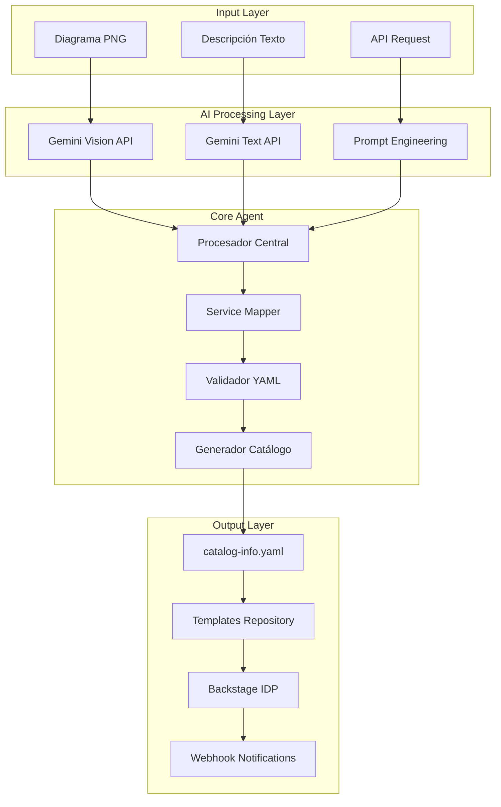

# AWS Architecture AI Agent - Base Implementation

## Agente Especializado en Arquitectura AWS

Este agente IA está diseñado para analizar arquitecturas AWS y generar automáticamente catálogos de servicios para Backstage IDP, basado en las mejores prácticas de GenSpark AI.

### Capacidades Principales

1. **Análisis de Diagramas**: Procesa imágenes PNG de arquitecturas AWS
2. **Procesamiento de Texto**: Interpreta descripciones textuales de infraestructura  
3. **Generación YAML**: Crea archivos catalog-info.yaml válidos para Backstage
4. **Integración Git**: Automatiza commits al repositorio de templates
5. **Validación**: Verifica estructura y esquemas de Backstage

### Arquitectura del Sistema



### Mapeo de Servicios AWS a Backstage

| AWS Service | Backstage Kind | Type | Owner | Lifecycle |
|-------------|----------------|------|-------|-----------|
| S3 Bucket | Resource | storage | platform-team | production |
| Lambda Function | Component | service | platform-team | production |
| CloudFront | Component | cdn | platform-team | production |
| API Gateway | Component | api | platform-team | production |
| RDS | Resource | database | platform-team | production |
| DynamoDB | Resource | database | platform-team | production |
| Route53 | Resource | dns | platform-team | production |
| CloudWatch | Resource | monitoring | platform-team | production |
| ECS/Fargate | Component | service | platform-team | production |
| ALB/NLB | Component | load-balancer | platform-team | production |

### Estructura de Salida YAML Optimizada

```yaml
apiVersion: backstage.io/v1alpha1
kind: System
metadata:
  name: aws-architecture-system
  title: "Sistema AWS Generado por IA"
  description: "Sistema de arquitectura AWS analizado y catalogado automáticamente"
  tags:
    - aws
    - ai-generated
    - architecture
  annotations:
    aws.com/cost-center: "free-tier-audit"
    ai-agent.com/generated: "true"
    ai-agent.com/timestamp: "2026-01-15T21:57:00Z"
    ai-agent.com/version: "1.0.0"
    github.com/project-slug: "giovanemere/demo-infra-ai-agent"
spec:
  owner: platform-team
  domain: infrastructure
---
apiVersion: backstage.io/v1alpha1
kind: Component
metadata:
  name: web-application
  title: "Aplicación Web Serverless"
  description: "Aplicación web construida con arquitectura serverless en AWS"
  tags:
    - serverless
    - web
    - aws
  annotations:
    aws.com/cost-center: "free-tier-audit"
    aws.com/region: "us-east-1"
    aws.com/service-type: "serverless"
    github.com/project-slug: "user/web-application"
spec:
  type: website
  lifecycle: production
  owner: platform-team
  system: aws-architecture-system
  dependsOn:
    - resource:default/storage-bucket
    - component:default/cdn-distribution
  providesApis:
    - web-api
---
apiVersion: backstage.io/v1alpha1
kind: Resource
metadata:
  name: storage-bucket
  title: "S3 Storage Bucket"
  description: "Bucket S3 para almacenamiento de assets estáticos"
  tags:
    - storage
    - s3
    - aws
  annotations:
    aws.com/cost-center: "free-tier-audit"
    aws.com/service: "s3"
    aws.com/resource-arn: "arn:aws:s3:::my-bucket"
spec:
  type: storage
  owner: platform-team
  system: aws-architecture-system
```

### API Endpoints Mejorados

#### POST /analyze-architecture
Endpoint principal para análisis completo de arquitectura

**Request:**
```json
{
  "type": "diagram|text|hybrid",
  "content": {
    "image": "base64_encoded_image",
    "description": "Descripción textual adicional",
    "context": "Información de contexto del proyecto"
  },
  "metadata": {
    "project_name": "my-awesome-project",
    "environment": "production|staging|development",
    "cost_center": "free-tier-audit",
    "owner": "platform-team",
    "domain": "infrastructure",
    "tags": ["serverless", "web", "aws"]
  },
  "options": {
    "generate_system": true,
    "include_dependencies": true,
    "validate_strict": true,
    "auto_commit": true
  }
}
```

**Response:**
```json
{
  "status": "success",
  "request_id": "req_123456789",
  "analysis": {
    "components_detected": 5,
    "resources_identified": 3,
    "services_identified": ["s3", "lambda", "cloudfront", "apigateway"],
    "architecture_type": "serverless-web",
    "complexity_score": 7.5,
    "estimated_cost": "< $50/month",
    "security_score": 8.2
  },
  "generated_artifacts": {
    "yaml_content": "apiVersion: backstage.io/v1alpha1...",
    "components_count": 5,
    "resources_count": 3,
    "systems_count": 1
  },
  "repository": {
    "commit_url": "https://github.com/user/templates/commit/abc123",
    "file_url": "https://github.com/user/templates/blob/main/components/my-project.yaml",
    "pr_url": "https://github.com/user/templates/pull/42"
  },
  "backstage": {
    "catalog_url": "https://backstage.company.com/catalog/default/system/my-project",
    "import_status": "pending|success|failed"
  },
  "validation": {
    "yaml_valid": true,
    "backstage_schema_valid": true,
    "dependencies_resolved": true,
    "warnings": [],
    "errors": []
  }
}
```

### Configuración Avanzada del Agente

```python
# config/agent_config.py
from dataclasses import dataclass
from typing import Dict, List, Optional

@dataclass
class AgentConfig:
    # AI Models Configuration
    VISION_MODEL: str = "gemini-1.5-pro"
    TEXT_MODEL: str = "gemini-1.5-pro"
    MAX_TOKENS: int = 8192
    TEMPERATURE: float = 0.1
    
    # AWS Service Mapping
    SERVICE_MAPPING: Dict[str, Dict[str, str]] = {
        "s3": {"kind": "Resource", "type": "storage", "category": "storage"},
        "lambda": {"kind": "Component", "type": "service", "category": "compute"},
        "cloudfront": {"kind": "Component", "type": "cdn", "category": "networking"},
        "apigateway": {"kind": "Component", "type": "api", "category": "networking"},
        "rds": {"kind": "Resource", "type": "database", "category": "database"},
        "dynamodb": {"kind": "Resource", "type": "database", "category": "database"},
        "route53": {"kind": "Resource", "type": "dns", "category": "networking"},
        "cloudwatch": {"kind": "Resource", "type": "monitoring", "category": "observability"},
        "ecs": {"kind": "Component", "type": "service", "category": "compute"},
        "fargate": {"kind": "Component", "type": "service", "category": "compute"},
        "alb": {"kind": "Component", "type": "load-balancer", "category": "networking"},
        "nlb": {"kind": "Component", "type": "load-balancer", "category": "networking"}
    }
    
    # Backstage Defaults
    DEFAULT_OWNER: str = "platform-team"
    DEFAULT_LIFECYCLE: str = "production"
    DEFAULT_DOMAIN: str = "infrastructure"
    COST_CENTER: str = "free-tier-audit"
    
    # Repository Configuration
    TEMPLATES_REPO: str = "git@github.com:giovanemere/demo-infra-ai-agent-template-idp.git"
    COMPONENTS_PATH: str = "components"
    RESOURCES_PATH: str = "resources"
    SYSTEMS_PATH: str = "systems"
    
    # Validation Rules
    REQUIRED_FIELDS: List[str] = ["apiVersion", "kind", "metadata", "spec"]
    REQUIRED_METADATA: List[str] = ["name"]
    REQUIRED_SPEC: List[str] = ["owner"]
    
    # Processing Options
    AUTO_GENERATE_SYSTEM: bool = True
    INCLUDE_DEPENDENCIES: bool = True
    VALIDATE_STRICT: bool = True
    AUTO_COMMIT: bool = True
    CREATE_PR: bool = False
```

### Prompts Especializados Mejorados

#### Vision Analysis Prompt
```python
VISION_PROMPT = """
Eres un arquitecto de soluciones AWS Senior con 10+ años de experiencia. Analiza este diagrama de arquitectura AWS con precisión técnica.

TAREAS:
1. Identifica TODOS los servicios AWS visibles en el diagrama
2. Determina las conexiones y flujo de datos entre servicios
3. Clasifica el patrón arquitectónico (serverless, microservicios, monolítico, híbrido)
4. Evalúa la complejidad y escalabilidad de la solución
5. Genera catalog-info.yaml completo y válido para Backstage

REGLAS DE MAPEO:
- S3 Bucket → Resource/storage
- Lambda → Component/service  
- CloudFront → Component/cdn
- API Gateway → Component/api
- RDS/Aurora → Resource/database
- DynamoDB → Resource/database
- Route53 → Resource/dns
- CloudWatch → Resource/monitoring
- ECS/Fargate → Component/service
- ALB/NLB → Component/load-balancer

ESTRUCTURA REQUERIDA:
1. System principal (si hay múltiples componentes)
2. Components para servicios computacionales
3. Resources para almacenamiento/datos
4. APIs si hay endpoints expuestos
5. Dependencias correctas entre elementos

ANOTACIONES OBLIGATORIAS:
- aws.com/cost-center: free-tier-audit
- aws.com/region: [detectar región]
- aws.com/service: [nombre del servicio]
- ai-agent.com/generated: true
- ai-agent.com/confidence: [0.0-1.0]

FORMATO: Solo YAML válido, sin explicaciones adicionales.
"""

TEXT_ANALYSIS_PROMPT = """
Eres un arquitecto de soluciones AWS Senior. Analiza esta descripción de arquitectura y genera un catálogo Backstage completo.

DESCRIPCIÓN: {text_input}

PROCESO DE ANÁLISIS:
1. Extrae todos los servicios AWS mencionados
2. Identifica patrones arquitectónicos
3. Determina relaciones y dependencias
4. Evalúa el dominio y propósito del sistema
5. Genera YAML estructurado y válido

VALIDACIONES:
- Nombres en kebab-case
- Referencias válidas entre componentes
- Metadatos completos y consistentes
- Anotaciones AWS apropiadas
- Estructura jerárquica correcta

FORMATO: Solo YAML válido para Backstage, sin texto adicional.
"""
```

### Sistema de Validación Avanzado

```python
# validators/advanced_validator.py
class AdvancedBackstageValidator:
    def __init__(self):
        self.errors = []
        self.warnings = []
        
    def validate_complete(self, yaml_content: str) -> Dict[str, Any]:
        """Validación completa con reportes detallados"""
        result = {
            "valid": True,
            "errors": [],
            "warnings": [],
            "suggestions": []
        }
        
        # Validaciones básicas
        if not self._validate_yaml_syntax(yaml_content):
            result["valid"] = False
            result["errors"].append("Invalid YAML syntax")
            
        # Validaciones de esquema Backstage
        if not self._validate_backstage_schema(yaml_content):
            result["valid"] = False
            result["errors"].extend(self.errors)
            
        # Validaciones de dependencias
        if not self._validate_dependencies(yaml_content):
            result["warnings"].extend(self.warnings)
            
        # Sugerencias de mejora
        result["suggestions"] = self._generate_suggestions(yaml_content)
        
        return result
```

### Métricas y Observabilidad

```python
# monitoring/metrics.py
class AgentMetrics:
    def __init__(self):
        self.metrics = {
            "analyses_total": 0,
            "analyses_successful": 0,
            "analyses_failed": 0,
            "processing_time_avg": 0.0,
            "services_detected": {},
            "architecture_patterns": {},
            "validation_errors": {}
        }
    
    def record_analysis(self, success: bool, processing_time: float, 
                       services: List[str], pattern: str):
        """Registra métricas de análisis"""
        self.metrics["analyses_total"] += 1
        
        if success:
            self.metrics["analyses_successful"] += 1
        else:
            self.metrics["analyses_failed"] += 1
            
        # Actualizar tiempo promedio
        current_avg = self.metrics["processing_time_avg"]
        total = self.metrics["analyses_total"]
        self.metrics["processing_time_avg"] = (
            (current_avg * (total - 1) + processing_time) / total
        )
        
        # Contar servicios detectados
        for service in services:
            self.metrics["services_detected"][service] = (
                self.metrics["services_detected"].get(service, 0) + 1
            )
            
        # Contar patrones arquitectónicos
        self.metrics["architecture_patterns"][pattern] = (
            self.metrics["architecture_patterns"].get(pattern, 0) + 1
        )
```

Esta base de implementación proporciona:

1. **Arquitectura robusta** con separación clara de responsabilidades
2. **API completa** con endpoints especializados
3. **Validación avanzada** con reportes detallados
4. **Métricas integradas** para monitoreo y mejora continua
5. **Configuración flexible** para diferentes entornos
6. **Prompts optimizados** para análisis precisos
7. **Integración completa** con Backstage IDP

¿Te gustaría que profundice en algún aspecto específico o que genere el catálogo YAML para cargar automáticamente en el IDP?
